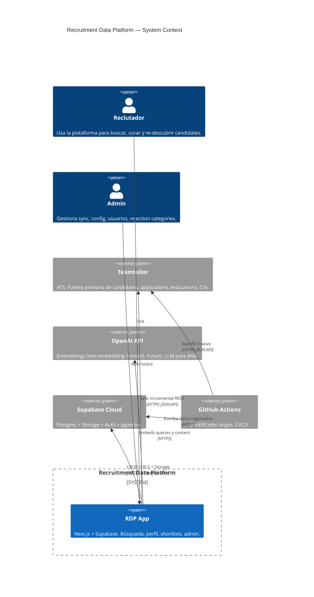
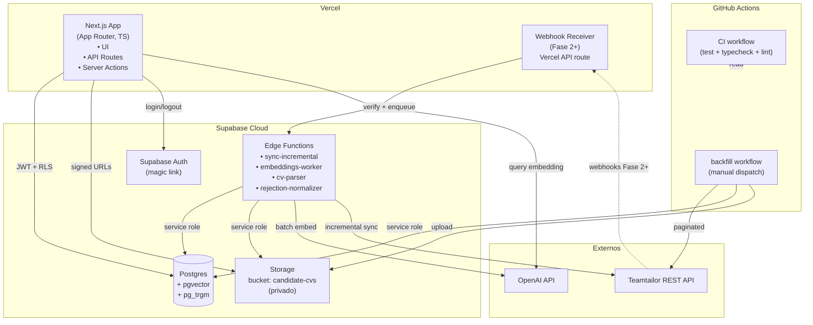
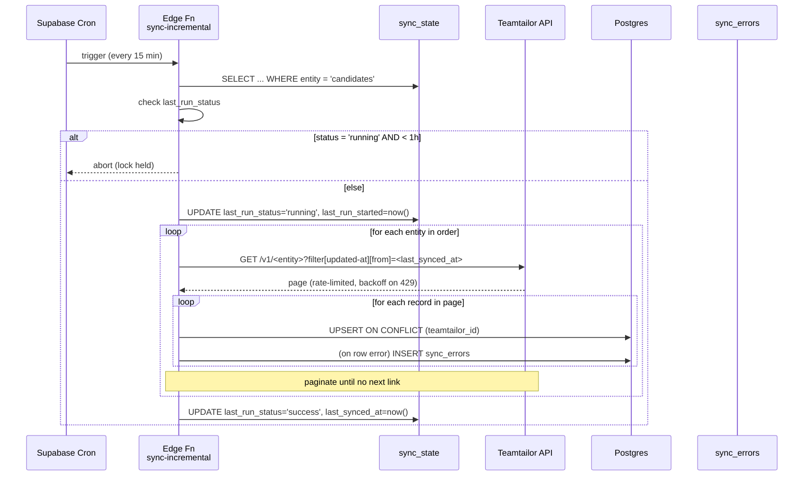
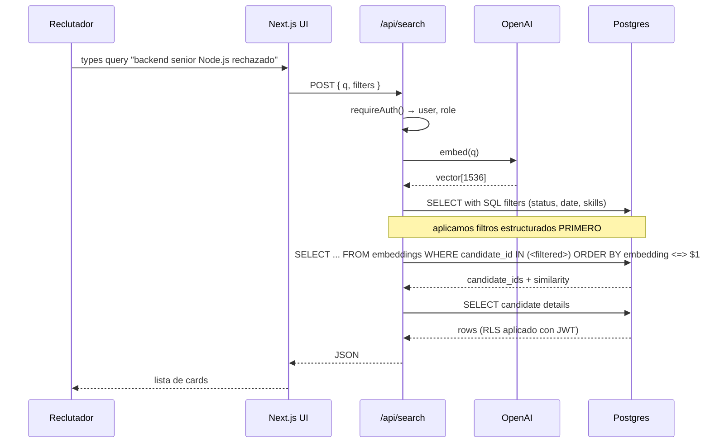

# 🏗️ Architecture — Recruitment Data Platform

> Este documento es el **paso 2 del initialization cascade** del
> paper GS (§6.2). Es la representación estructural del sistema;
> los diagramas **son** la arquitectura, no su ilustración.
>
> Derivado de: `spec.md` §3 + ADR-001 + ADR-003 + ADR-004 + ADR-005 + ADR-006.

---

## 1. Contexto (C4 nivel 1)

Quién usa el sistema y qué sistemas externos participan.

**Notas**:
- El único usuario humano es interno de VAIRIX (no hay acceso público).
- Teamtailor es **la única fuente** de datos de dominio en Fase 1.
- OpenAI solo se usa para embeddings en Fase 1; LLM para RAG en Fase 4.
- GitHub Actions convive con Supabase Edge Functions (ADR-004).

---

## 2. Containers (C4 nivel 2)

Los deployables y su comunicación.

**Regla de oro**: el navegador del usuario **nunca** habla con
Teamtailor u OpenAI directo. Todo pasa por Next.js (con JWT), o
Edge Functions (con service role en jobs).

---

## 3. Containers — responsabilidades

### 3.1 Next.js App (Vercel)

- **UI** — React Server Components + Client Components.
- **API Routes / Server Actions** — auth + validación + delegación a
  services. Nunca lógica de negocio directa.
- **Generación de URLs firmadas** para CVs (expiración 1 h).
- **Embeddings de queries de búsqueda** (sincrónico, latencia
  ~300 ms aceptable).

**NO hace**: sync con Teamtailor, backfill, parsing de CVs,
generación masiva de embeddings.

### 3.2 Supabase Edge Functions

- `sync-incremental` — cron cada 15 min; invoca funciones por
  entidad en orden (stages → users → jobs → candidates →
  applications → evaluations/notes → files).
- `embeddings-worker` — cron cada 15 min; lee fuentes con
  `content_hash` outdated, regenera.
- `cv-parser` — triggered post-upload, extrae texto con `pdf-parse`
  / `mammoth`, persiste en `files.parsed_text`.
- `rejection-normalizer` — post-sync de evaluations, aplica keyword
  matching (ADR-007).

**NO hace**: backfill masivo (se excede el timeout de 150 s).

### 3.3 GitHub Actions

- **`backfill.yml`** — workflow manual (`workflow_dispatch`) para el
  sync inicial. Matrix por entidad. Puede correr horas.
- **`ci.yml`** — corre en cada PR y push. Typecheck + lint + unit +
  integration contra Supabase local + mutation testing (gate
  pre-release).

### 3.4 Postgres (Supabase)

Una sola base. Schema en `public`. Ver `data-model.md`.

Características activas:
- `pgvector` para embeddings (ADR-001, ADR-005)
- `pg_trgm` para fuzzy matching de nombres
- `uuid-ossp` para IDs
- RLS activa en todas las tablas de dominio (ADR-003)
- Triggers `updated_at` genéricos

### 3.5 Storage

- Un bucket: `candidate-cvs` (privado).
- Paths: `<candidate_uuid>/<file_uuid>.<ext>`.
- Acceso: SOLO via signed URLs con TTL = 1 h, generadas por API
  route autenticada.

---

## 4. Data flow — Sync incremental (secuencia)

Ver detalles en ADR-002 + ADR-004.

---

## 5. Data flow — Búsqueda híbrida (secuencia)

---

## 6. Cross-cutting concerns

### Observabilidad (Fase 1 mínima)

- Logs estructurados JSON a stdout, campos base: `timestamp`,
  `level`, `scope`, `message`, `meta`.
- ETL errors → `sync_state.last_run_error` + `sync_errors`.
- Métricas agregadas: Fase 2+.

### Auth

- Supabase Auth con magic link (sin registro público).
- JWT con custom claim `role` derivado de `app_users.role`.
- RLS usa `auth.jwt() ->> 'role'` para gating.

### Rate limiting

- Cliente Teamtailor envuelve token bucket ~4 req/s, burst 10.
- Backoff exponencial + jitter en 429.
- Respeta `Retry-After`.

### Secrets

- Ninguno en el repo. Documentados en `.env.example`.
- Supabase Edge Functions: secrets vía `supabase secrets set`.
- GitHub Actions: vía `secrets.*`.
- Vercel: vía dashboard.

---

## 7. Boundaries que NO se violan

Lista explícita (derivada de las reglas de CLAUDE.md):

1. UI no llama Teamtailor ni OpenAI directo. Siempre vía service.
2. ETL no genera embeddings ni parsea CVs.
3. Service role key: solo en Edge Functions y GitHub Actions.
   Nunca en código que corre con identidad de usuario.
4. Tests no pegan a Teamtailor producción. Usan MSW + fixtures.
5. Ningún `DELETE` físico desde UI en Fase 1.

Si un cambio propone cruzar un boundary, requiere ADR.

---

## 8. Reevaluación

Esta arquitectura se revisita si:
- Volumen supera 50k candidates (actualmente ~5k, ver ADR-001).
- p95 de query vectorial > 500 ms.
- Aparece segundo ATS además de Teamtailor → introducir capa de
  abstracción de fuentes.
- Multi-tenant se activa (ver ADR-003 hedge).

Cada caso arriba requiere nuevo ADR.
