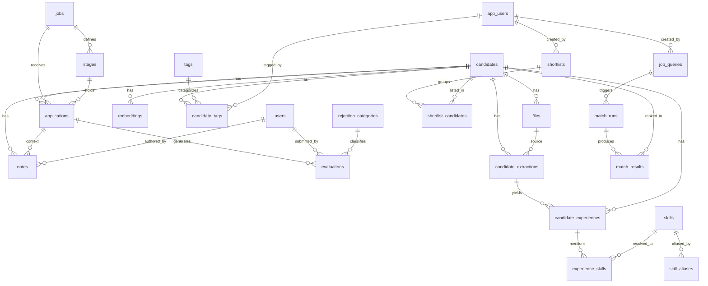

# 🗄️ Data Model — Recruitment Data Platform

> Schema canónico de la base de datos. Toda migración debe partir de
> este documento. Si el schema cambia, actualizar acá **y** crear la
> migración correspondiente en `supabase/migrations/`.
>
> **ADRs relacionados**: 001, 002, 003, 004, 005, 006, 007, 012, 013, 014, 015.

---

## Principios de diseño

1. **IDs internos** en `uuid`; IDs externos como `teamtailor_id` (text).
2. **Nunca** FK contra `teamtailor_id`. Siempre resolver a `uuid` interno.
3. **`raw_data jsonb`** en cada tabla espejo con el payload original.
4. **Timestamps triples** donde aplica:
   - `created_at` — creación en Teamtailor
   - `updated_at` — última modificación en Teamtailor
   - `synced_at` — última vez que lo trajimos a nuestra DB
5. **Upsert por `teamtailor_id`**, siempre. Nunca insert ciego.
6. **Soft delete**: columna `deleted_at` en vez de `DELETE` físico.
7. **`tenant_id uuid` nullable** en tablas de dominio (hedge
   multi-tenant futuro, ver ADR-003). En Fase 1 queda null o con un
   UUID fijo por env.
8. **Row Level Security (RLS)** activa; policies en ADR-003 y en las
   migraciones.

---

## Extensiones requeridas

```sql
create extension if not exists "uuid-ossp";
create extension if not exists "vector";
create extension if not exists "pg_trgm";
```

---

## Trigger genérico de updated_at

```sql
create or replace function set_updated_at()
returns trigger as $$
begin
  new.updated_at = now();
  return new;
end;
$$ language plpgsql;
```

---

## 1. `app_users`

Tabla interna de usuarios de la aplicación (no confundir con `users`
sincronizados desde Teamtailor ni con `auth.users` de Supabase).

```sql
create table app_users (
  id             uuid primary key default uuid_generate_v4(),
  auth_user_id   uuid unique not null references auth.users(id) on delete cascade,
  email          text not null,
  full_name      text,
  role           text not null check (role in ('recruiter', 'admin')),
  tenant_id      uuid,
  deactivated_at timestamptz,
  created_at     timestamptz not null default now(),
  updated_at     timestamptz not null default now()
);

create index idx_app_users_auth_user on app_users(auth_user_id);
create index idx_app_users_role      on app_users(role);

create trigger trg_app_users_updated_at
  before update on app_users
  for each row execute function set_updated_at();
```

---

## 2. `candidates`

```sql
create table candidates (
  id             uuid primary key default uuid_generate_v4(),
  tenant_id      uuid,
  teamtailor_id  text unique not null,
  first_name     text,
  last_name      text,
  email          text,
  phone          text,
  linkedin_url   text,
  pitch          text,
  sourced        boolean default false,
  raw_data       jsonb,
  deleted_at     timestamptz,
  created_at     timestamptz not null default now(),
  updated_at     timestamptz not null default now(),
  synced_at      timestamptz not null default now()
);

create index idx_candidates_teamtailor_id on candidates(teamtailor_id);
create index idx_candidates_email         on candidates(email);
create index idx_candidates_updated_at    on candidates(updated_at desc);
create index idx_candidates_deleted_at    on candidates(deleted_at)
  where deleted_at is null;
create index idx_candidates_tenant        on candidates(tenant_id);

create index idx_candidates_name_trgm on candidates
  using gin ((coalesce(first_name,'') || ' ' || coalesce(last_name,''))
             gin_trgm_ops);

create trigger trg_candidates_updated_at
  before update on candidates
  for each row execute function set_updated_at();
```

---

## 3. `users` (evaluadores sincronizados de Teamtailor)

Todos los usuarios internos de VAIRIX que aparecen como evaluadores
en Teamtailor. Distinta tabla que `app_users`.

```sql
create table users (
  id             uuid primary key default uuid_generate_v4(),
  tenant_id      uuid,
  teamtailor_id  text unique not null,
  email          text,
  full_name      text,
  role           text,
  active         boolean default true,
  raw_data       jsonb,
  created_at     timestamptz not null default now(),
  updated_at     timestamptz not null default now(),
  synced_at      timestamptz not null default now()
);

create index idx_users_teamtailor_id on users(teamtailor_id);
create index idx_users_email         on users(email);

create trigger trg_users_updated_at
  before update on users
  for each row execute function set_updated_at();
```

---

## 4. `jobs`

```sql
create table jobs (
  id             uuid primary key default uuid_generate_v4(),
  tenant_id      uuid,
  teamtailor_id  text unique not null,
  title          text not null,
  department     text,
  location       text,
  status         text check (status in ('open','draft','archived','unlisted')),
  pitch          text,
  body           text,
  raw_data       jsonb,
  deleted_at     timestamptz,
  created_at     timestamptz not null default now(),
  updated_at     timestamptz not null default now(),
  synced_at      timestamptz not null default now()
);

create index idx_jobs_teamtailor_id on jobs(teamtailor_id);
create index idx_jobs_status        on jobs(status);
create index idx_jobs_updated_at    on jobs(updated_at desc);

create trigger trg_jobs_updated_at
  before update on jobs
  for each row execute function set_updated_at();
```

---

## 5. `stages`

Catálogo de stages del pipeline, por job.

```sql
create table stages (
  id             uuid primary key default uuid_generate_v4(),
  tenant_id      uuid,
  teamtailor_id  text unique not null,
  job_id         uuid references jobs(id) on delete cascade,
  name           text not null,
  slug           text,
  position       integer,
  category       text,   -- applied, interviewing, offer, hired, rejected
  raw_data       jsonb,
  created_at     timestamptz not null default now(),
  updated_at     timestamptz not null default now(),
  synced_at      timestamptz not null default now()
);

create index idx_stages_job           on stages(job_id);
create index idx_stages_teamtailor_id on stages(teamtailor_id);

create trigger trg_stages_updated_at
  before update on stages
  for each row execute function set_updated_at();
```

---

## 6. `applications`

```sql
create table applications (
  id             uuid primary key default uuid_generate_v4(),
  tenant_id      uuid,
  teamtailor_id  text unique not null,
  candidate_id   uuid not null references candidates(id) on delete cascade,
  job_id         uuid references jobs(id) on delete set null,
  stage_id       uuid references stages(id) on delete set null,
  stage_name     text,   -- snapshot legible sincronizado
  status         text check (status in ('active','rejected','hired','withdrawn')),
  source         text,
  cover_letter   text,
  rejected_at    timestamptz,
  hired_at       timestamptz,
  raw_data       jsonb,
  deleted_at     timestamptz,
  created_at     timestamptz not null default now(),
  updated_at     timestamptz not null default now(),
  synced_at      timestamptz not null default now()
);

create index idx_applications_candidate on applications(candidate_id);
create index idx_applications_job       on applications(job_id);
create index idx_applications_stage     on applications(stage_id);
create index idx_applications_status    on applications(status);
create index idx_applications_updated   on applications(updated_at desc);

create trigger trg_applications_updated_at
  before update on applications
  for each row execute function set_updated_at();
```

---

## 7. `rejection_categories`

Catálogo normalizado. Ver ADR-007.

```sql
create table rejection_categories (
  id            uuid primary key default uuid_generate_v4(),
  code          text unique not null,
  display_name  text not null,
  description   text,
  sort_order    integer,
  deprecated_at timestamptz,
  created_at    timestamptz not null default now(),
  updated_at    timestamptz not null default now()
);

create index idx_rejection_categories_code on rejection_categories(code);

create trigger trg_rejection_categories_updated_at
  before update on rejection_categories
  for each row execute function set_updated_at();

insert into rejection_categories (code, display_name, sort_order) values
  ('technical_skills',    'Nivel técnico insuficiente', 10),
  ('experience_level',    'Seniority no encaja',         20),
  ('communication',       'Comunicación',                30),
  ('culture_fit',         'Cultural fit',                40),
  ('salary_expectations', 'Expectativas salariales',     50),
  ('availability',        'Disponibilidad',              60),
  ('location',            'Ubicación / time zone',       70),
  ('no_show',             'No se presentó',              80),
  ('ghosting',            'Dejó de responder',           90),
  ('position_filled',     'Posición cubierta',           100),
  ('other',               'Otro',                         999);
```

---

## 8. `evaluations`

```sql
create table evaluations (
  id                         uuid primary key default uuid_generate_v4(),
  tenant_id                  uuid,
  teamtailor_id              text unique,
  candidate_id               uuid not null references candidates(id) on delete cascade,
  application_id             uuid references applications(id) on delete cascade,
  user_id                    uuid references users(id) on delete set null,
  evaluator_name             text,
  score                      numeric,
  decision                   text check (decision in ('accept','reject','pending','on_hold')),
  rejection_reason           text,
  rejection_category_id      uuid references rejection_categories(id) on delete set null,
  needs_review               boolean default false,
  normalization_attempted_at timestamptz,
  notes                      text,
  raw_data                   jsonb,
  deleted_at                 timestamptz,
  created_at                 timestamptz not null default now(),
  updated_at                 timestamptz not null default now(),
  synced_at                  timestamptz not null default now()
);

create index idx_evaluations_candidate    on evaluations(candidate_id);
create index idx_evaluations_application  on evaluations(application_id);
create index idx_evaluations_user         on evaluations(user_id);
create index idx_evaluations_decision     on evaluations(decision);
create index idx_evaluations_category     on evaluations(rejection_category_id);
create index idx_evaluations_needs_review on evaluations(needs_review)
  where needs_review = true;
create index idx_evaluations_notes_trgm   on evaluations
  using gin (notes gin_trgm_ops);

create trigger trg_evaluations_updated_at
  before update on evaluations
  for each row execute function set_updated_at();
```

---

## 9. `notes` (comentarios libres de Teamtailor)

**No confundir** con `evaluations.notes`.

```sql
create table notes (
  id             uuid primary key default uuid_generate_v4(),
  tenant_id      uuid,
  teamtailor_id  text unique,
  candidate_id   uuid not null references candidates(id) on delete cascade,
  application_id uuid references applications(id) on delete set null,
  user_id        uuid references users(id) on delete set null,
  author_name    text,
  body           text not null,
  raw_data       jsonb,
  deleted_at     timestamptz,
  created_at     timestamptz not null default now(),
  updated_at     timestamptz not null default now(),
  synced_at      timestamptz not null default now()
);

create index idx_notes_candidate   on notes(candidate_id);
create index idx_notes_application on notes(application_id);
create index idx_notes_body_trgm   on notes using gin (body gin_trgm_ops);

create trigger trg_notes_updated_at
  before update on notes
  for each row execute function set_updated_at();
```

---

## 10. `files` (CVs)

Ver ADR-006 para el ciclo de vida.

```sql
create table files (
  id              uuid primary key default uuid_generate_v4(),
  tenant_id       uuid,
  teamtailor_id   text unique,
  candidate_id    uuid not null references candidates(id) on delete cascade,
  storage_path    text not null,       -- path interno en bucket privado
  file_type       text,                -- pdf, docx, doc, txt, rtf
  file_size_bytes bigint,
  content_hash    text,                -- SHA-256 del binario
  parsed_text     text,
  parsed_at       timestamptz,
  parse_error     text,                -- unsupported_format, parse_failure, empty_text, likely_scanned
  raw_data        jsonb,
  deleted_at      timestamptz,
  created_at      timestamptz not null default now(),
  updated_at      timestamptz not null default now(),
  synced_at       timestamptz not null default now()
);

create index idx_files_candidate    on files(candidate_id);
create index idx_files_content_hash on files(content_hash);
create index idx_files_parse_error  on files(parse_error)
  where parse_error is not null;
create index idx_files_parsed_text  on files
  using gin (to_tsvector('simple', coalesce(parsed_text, '')));

create trigger trg_files_updated_at
  before update on files
  for each row execute function set_updated_at();
```

> **Nota**: no se almacena `file_url`. Las URLs firmadas se generan
> on-demand desde API routes autenticadas. Ver ADR-006.

---

## 11. `tags` y `candidate_tags`

```sql
create table tags (
  id         uuid primary key default uuid_generate_v4(),
  tenant_id  uuid,
  name       text unique not null,
  category   text,   -- skill, seniority, behavior, manual, auto
  created_at timestamptz not null default now()
);

create index idx_tags_category on tags(category);

create table candidate_tags (
  candidate_id uuid not null references candidates(id) on delete cascade,
  tag_id       uuid not null references tags(id) on delete cascade,
  source       text default 'manual' check (source in ('manual','auto')),
  confidence   numeric,
  created_by   uuid references app_users(id) on delete set null,
  created_at   timestamptz not null default now(),
  primary key (candidate_id, tag_id)
);

create index idx_candidate_tags_tag on candidate_tags(tag_id);
```

---

## 12. `shortlists`

**Fase 1.** Ver spec §2.4.

```sql
create table shortlists (
  id          uuid primary key default uuid_generate_v4(),
  tenant_id   uuid,
  name        text not null,
  description text,
  created_by  uuid not null references app_users(id) on delete restrict,
  job_id      uuid references jobs(id) on delete set null,
  archived_at timestamptz,
  created_at  timestamptz not null default now(),
  updated_at  timestamptz not null default now()
);

create index idx_shortlists_created_by on shortlists(created_by);
create index idx_shortlists_job        on shortlists(job_id);

create trigger trg_shortlists_updated_at
  before update on shortlists
  for each row execute function set_updated_at();

create table shortlist_candidates (
  shortlist_id uuid not null references shortlists(id) on delete cascade,
  candidate_id uuid not null references candidates(id) on delete cascade,
  added_by     uuid not null references app_users(id) on delete restrict,
  note         text,
  added_at     timestamptz not null default now(),
  primary key (shortlist_id, candidate_id)
);
```

---

## 13. `embeddings`

Ver ADR-005.

```sql
create table embeddings (
  id            uuid primary key default uuid_generate_v4(),
  tenant_id     uuid,
  candidate_id  uuid not null references candidates(id) on delete cascade,
  source_type   text not null check (source_type in ('cv','evaluation','notes','profile')),
  source_id     uuid,                                   -- FK lógica
  content       text not null,
  content_hash  text not null,                          -- SHA-256(content || model)
  embedding     vector(1536),                           -- text-embedding-3-small
  model         text not null default 'text-embedding-3-small',
  created_at    timestamptz not null default now(),
  updated_at    timestamptz not null default now()
);

create unique index uq_embeddings_source
  on embeddings(candidate_id, source_type, source_id);
create index idx_embeddings_candidate on embeddings(candidate_id);
create index idx_embeddings_hash      on embeddings(content_hash);

create index idx_embeddings_vector on embeddings
  using ivfflat (embedding vector_cosine_ops) with (lists = 100);

create trigger trg_embeddings_updated_at
  before update on embeddings
  for each row execute function set_updated_at();
```

> Con 5k candidates × 3 fuentes ≈ 15k embeddings. `lists = 100` es
> un buen compromiso hasta ~1M vectores. Reevaluar al crecer.

---

## 14. `sync_state`

Ver ADR-004.

```sql
create table sync_state (
  id                    uuid primary key default uuid_generate_v4(),
  entity                text unique not null,
  last_synced_at        timestamptz,
  last_cursor           text,
  last_run_started      timestamptz,
  last_run_finished     timestamptz,
  last_run_status       text check (last_run_status in ('idle','running','success','error')),
  last_run_error        text,
  records_synced        integer default 0,
  stale_timeout_minutes integer default 60,
  updated_at            timestamptz not null default now()
);

create trigger trg_sync_state_updated_at
  before update on sync_state
  for each row execute function set_updated_at();

insert into sync_state (entity, last_run_status) values
  ('stages', 'idle'),
  ('users', 'idle'),
  ('jobs', 'idle'),
  ('candidates', 'idle'),
  ('applications', 'idle'),
  ('evaluations', 'idle'),
  ('notes', 'idle'),
  ('files', 'idle');
```

---

## 15. `sync_errors`

Errores puntuales a nivel registro.

```sql
create table sync_errors (
  id             uuid primary key default uuid_generate_v4(),
  entity         text not null,
  teamtailor_id  text,
  error_code     text,
  error_message  text,
  payload        jsonb,
  run_started_at timestamptz not null,
  resolved_at    timestamptz,
  created_at     timestamptz not null default now()
);

create index idx_sync_errors_entity     on sync_errors(entity);
create index idx_sync_errors_unresolved on sync_errors(resolved_at)
  where resolved_at is null;
```

---

## 16. Tablas F4 — Matching por descomposición (ADRs 012-015)

Las siguientes tablas habilitan UC-11 (matching de candidatos contra
un job description pegado por el recruiter). Orden de dependencias:
`skills` → `skill_aliases` → `candidate_extractions` →
`candidate_experiences` → `experience_skills` → `job_queries` →
`match_runs` → `match_results`.

### 16.1 `skills` (ADR-013)

Catálogo canónico de tecnologías y skills.

```sql
create table skills (
  id              uuid primary key default uuid_generate_v4(),
  canonical_name  text unique not null,       -- "React", "Node.js", "C++"
  slug            text unique not null,       -- "react", "node-js", "c-plus-plus"
  category        text not null check (category in (
                     'language', 'framework', 'database', 'platform',
                     'tool', 'methodology', 'soft_skill', 'other'
                  )),
  description     text,
  deprecated_at   timestamptz,
  created_by      uuid references app_users(id) on delete set null,
  created_at      timestamptz not null default now(),
  updated_at      timestamptz not null default now()
);

create index idx_skills_slug     on skills(slug);
create index idx_skills_category on skills(category);
create index idx_skills_name_trgm on skills using gin (canonical_name gin_trgm_ops);

create trigger trg_skills_updated_at
  before update on skills
  for each row execute function set_updated_at();
```

### 16.2 `skill_aliases` (ADR-013)

Alias no-canónicos ("reactjs", "node", "postgresql") resueltos al
`skills.id`.

```sql
create table skill_aliases (
  id                uuid primary key default uuid_generate_v4(),
  skill_id          uuid not null references skills(id) on delete cascade,
  alias_normalized  text unique not null,     -- lowercase + trim + puntuación preservada
  source            text not null check (source in ('curated', 'cv_derived', 'manual_admin')),
  created_by        uuid references app_users(id) on delete set null,
  created_at        timestamptz not null default now()
);

create index idx_skill_aliases_skill on skill_aliases(skill_id);
```

### 16.3 `skills_blacklist` (ADR-013)

Términos que el resolver debe ignorar activamente ("experience",
"team player", "communication") para no contaminar el catálogo.

```sql
create table skills_blacklist (
  id                uuid primary key default uuid_generate_v4(),
  term_normalized   text unique not null,
  reason            text,
  created_by        uuid references app_users(id) on delete set null,
  created_at        timestamptz not null default now()
);
```

### 16.4 Helper SQL: `public.resolve_skill(text)` (ADR-013)

Mirror de `src/lib/skills/resolver.ts`. Tests de equivalencia
(ADR-013 §2) garantizan que ambos coinciden.

```sql
create or replace function public.resolve_skill(raw text)
returns uuid as $$
declare
  normalized text;
  result_id  uuid;
begin
  if raw is null or length(trim(raw)) = 0 then
    return null;
  end if;

  -- lowercase → trim → strip terminal punct → preserve internal
  normalized := lower(trim(raw));
  normalized := regexp_replace(normalized, '[[:punct:]]+$', '');

  if exists (select 1 from skills_blacklist where term_normalized = normalized) then
    return null;
  end if;

  select id into result_id from skills where slug = normalized;
  if result_id is not null then return result_id; end if;

  select skill_id into result_id
  from skill_aliases where alias_normalized = normalized;

  return result_id;  -- puede ser null (uncataloged)
end;
$$ language plpgsql stable;
```

### 16.5 `candidate_extractions` (ADR-012)

Raw output del extractor LLM sobre CVs. Idempotente por
`content_hash`. No se normalizan skills acá — eso vive en
`experience_skills` (ADR-013).

```sql
create table candidate_extractions (
  id              uuid primary key default uuid_generate_v4(),
  tenant_id       uuid,
  candidate_id    uuid not null references candidates(id) on delete cascade,
  file_id         uuid not null references files(id) on delete cascade,
  source_variant  text not null check (source_variant in ('linkedin_export', 'cv_primary')),
  model           text not null,
  prompt_version  text not null,
  content_hash    text unique not null,       -- SHA256(parsed_text || NUL || model || NUL || prompt_version)
  raw_output      jsonb not null,             -- ExtractionResult completo
  extracted_at    timestamptz not null default now(),
  created_at      timestamptz not null default now()
);

create index idx_candidate_extractions_candidate on candidate_extractions(candidate_id);
create index idx_candidate_extractions_file      on candidate_extractions(file_id);
create index idx_candidate_extractions_variant   on candidate_extractions(source_variant);
```

### 16.6 `candidate_experiences` (ADR-012)

Experiencias individuales (work / side_project / education)
derivadas de `candidate_extractions.raw_output`. Unidad atómica
del matching.

```sql
create table candidate_experiences (
  id                uuid primary key default uuid_generate_v4(),
  tenant_id         uuid,
  candidate_id      uuid not null references candidates(id) on delete cascade,
  extraction_id     uuid not null references candidate_extractions(id) on delete cascade,
  source_variant    text not null check (source_variant in ('linkedin_export', 'cv_primary')),
  kind              text not null check (kind in ('work', 'side_project', 'education')),
  company           text,
  title             text,
  start_date        date,
  end_date          date,                     -- null = ongoing
  description       text,
  merged_from_ids   uuid[],                   -- diagnósticos del variant-merger (ADR-015)
  created_at        timestamptz not null default now()
);

create index idx_candidate_experiences_candidate on candidate_experiences(candidate_id);
create index idx_candidate_experiences_kind      on candidate_experiences(kind);
create index idx_candidate_experiences_dates     on candidate_experiences(start_date, end_date);
```

### 16.7 `experience_skills` (ADR-012 + ADR-013)

Skills mencionadas por experiencia, resueltas al catálogo. `skill_id`
nullable: null = uncataloged (no cuenta para `min_years` del
ranker; visible en `/admin/skills/uncataloged`).

```sql
create table experience_skills (
  id              uuid primary key default uuid_generate_v4(),
  experience_id   uuid not null references candidate_experiences(id) on delete cascade,
  skill_raw       text not null,              -- lo que dijo el LLM
  skill_id        uuid references skills(id) on delete set null,
  resolved_at     timestamptz,
  created_at      timestamptz not null default now()
);

create index idx_experience_skills_experience on experience_skills(experience_id);
create index idx_experience_skills_skill      on experience_skills(skill_id)
  where skill_id is not null;
create index idx_experience_skills_uncataloged on experience_skills(skill_raw)
  where skill_id is null;
```

### 16.8 `job_queries` (ADR-014)

Descomposiciones de job descriptions pegadas por el recruiter.
`decomposed_json` es inmutable; `resolved_json` se re-deriva contra
el catálogo actual sin re-llamar al LLM.

```sql
create table job_queries (
  id                   uuid primary key default uuid_generate_v4(),
  tenant_id            uuid,
  created_by           uuid references app_users(id) on delete set null,
  raw_text             text,                  -- purgable por política
  raw_text_retained    boolean not null default true,
  normalized_text      text not null,
  content_hash         text unique not null,  -- SHA256(normalized_text || NUL || prompt_version)
  model                text not null,
  prompt_version       text not null,
  decomposed_json      jsonb not null,        -- inmutable post-insert (policy)
  resolved_json        jsonb not null,        -- mutable: se re-deriva al cambiar catálogo
  unresolved_skills    text[] not null default '{}',
  resolved_at          timestamptz not null default now(),
  created_at           timestamptz not null default now()
);

create index idx_job_queries_created_by on job_queries(created_by);
create index idx_job_queries_tenant     on job_queries(tenant_id);
create index idx_job_queries_unresolved on job_queries using gin (unresolved_skills)
  where array_length(unresolved_skills, 1) > 0;
```

### 16.9 `match_runs` (ADR-015)

Ejecuciones del ranker. **Inmutables post-cierre**; si el catálogo
cambia, el recruiter ejecuta un run nuevo.

```sql
create table match_runs (
  id                    uuid primary key default uuid_generate_v4(),
  job_query_id          uuid not null references job_queries(id) on delete cascade,
  tenant_id             uuid,
  triggered_by          uuid references app_users(id) on delete set null,
  started_at            timestamptz not null default now(),
  finished_at           timestamptz,
  status                text not null default 'running'
    check (status in ('running', 'completed', 'failed')),
  candidates_evaluated  integer,
  diagnostics           jsonb,                -- warnings, skipped candidates
  catalog_snapshot_at   timestamptz not null,
  created_at            timestamptz not null default now()
);

create index idx_match_runs_job_query on match_runs(job_query_id);
create index idx_match_runs_tenant    on match_runs(tenant_id);
create index idx_match_runs_status    on match_runs(status);
```

### 16.10 `match_results` (ADR-015)

Resultado por candidato dentro de un `match_run`. `tenant_id`
duplicado intencionalmente (evita join en RLS policy).

```sql
create table match_results (
  match_run_id     uuid not null references match_runs(id) on delete cascade,
  candidate_id    uuid not null references candidates(id) on delete cascade,
  tenant_id        uuid,
  total_score      numeric(5, 2) not null,
  must_have_gate   text not null check (must_have_gate in ('passed', 'failed')),
  rank             integer not null,
  breakdown_json   jsonb not null,
  primary key (match_run_id, candidate_id)
);

create index idx_match_results_run_rank on match_results(match_run_id, rank);
create index idx_match_results_candidate on match_results(candidate_id);
create index idx_match_results_tenant    on match_results(tenant_id);
```

---

## 17. Row Level Security

RLS activa en todas las tablas de dominio. Policies concretas en
migraciones, siguiendo el patrón del ADR-003.

Matriz de acceso:

| Tabla                                | recruiter             | admin     |
| ------------------------------------ | --------------------- | --------- |
| `candidates`                         | R/W (no soft-deleted) | R/W total |
| `jobs`                               | R                     | R/W       |
| `stages`                             | R                     | R/W       |
| `applications`                       | R/W                   | R/W       |
| `evaluations`                        | R                     | R/W       |
| `notes`                              | R/W                   | R/W       |
| `files`                              | R                     | R/W       |
| `tags`, `candidate_tags`             | R/W                   | R/W       |
| `shortlists`, `shortlist_candidates` | R/W                   | R/W       |
| `embeddings`                         | R (indirecto)         | R/W       |
| `users`                              | R                     | R/W       |
| `app_users`                          | ❌                    | R/W       |
| `sync_state`, `sync_errors`          | ❌                    | R/W       |
| `rejection_categories`               | R                     | R/W       |
| `skills`, `skill_aliases`            | R                     | R/W       |
| `skills_blacklist`                   | ❌                    | R/W       |
| `candidate_extractions`              | R                     | R/W       |
| `candidate_experiences`              | R                     | R/W       |
| `experience_skills`                  | R                     | R/W       |
| `job_queries`                        | R/W (propios)         | R/W       |
| `match_runs`, `match_results`        | R (propios)           | R/W       |

El backend (ETL, embeddings worker, CV extractor, decomposition
worker, ranker) usa **service role key**, por lo que RLS no aplica a
esos jobs. RLS aplica exclusivamente a las conexiones con JWT de
usuario.

**Invariantes F4**:

- `job_queries.decomposed_json`: INSERT por user auth'd; UPDATE solo
  backend (re-resolve de `resolved_json`); `decomposed_json` nunca
  muta post-insert (policy o constraint).
- `match_runs` y `match_results`: INSERT por backend; UPDATE
  únicamente para cerrar run (`status = 'completed'` o
  `'failed'` + `finished_at`); `breakdown_json` inmutable.
- `candidate_extractions.raw_output` inmutable post-insert
  (idempotencia por `content_hash`).

---

## 18. Vistas útiles (propuestas)

### `v_candidate_summary`

Una fila por candidate con: conteo de applications, última activa,
último stage, última evaluation, tags agregadas, última actividad.

### `v_dormant_candidates`

Candidates sin application activa hace más de
`DORMANT_THRESHOLD_MONTHS` (default 12).

### `v_rejection_insights`

Agregado por `rejection_category` × mes × job × departamento.

Las vistas se implementan en migraciones separadas cuando haya
consumidores concretos.

---

## 19. Diagrama ER (Mermaid)



---

## 20. Convenciones de migraciones

- Archivos: `supabase/migrations/YYYYMMDDHHMMSS_description.sql`
- Cada migración es **idempotente**.
- Una migración = un cambio lógico. No mezclar refactors.
- Rollback documentado en comentario al inicio del archivo.
- RLS policies en migraciones separadas por tabla, naming
  `YYYYMMDDHHMMSS_rls_<tabla>.sql`.
