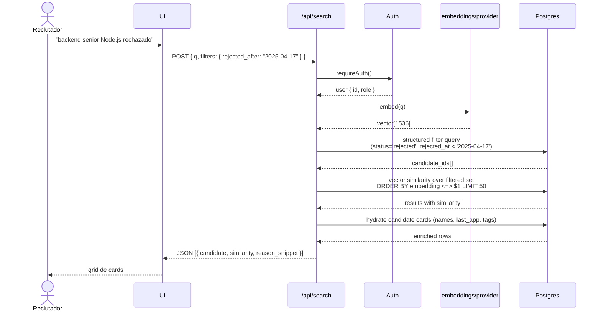
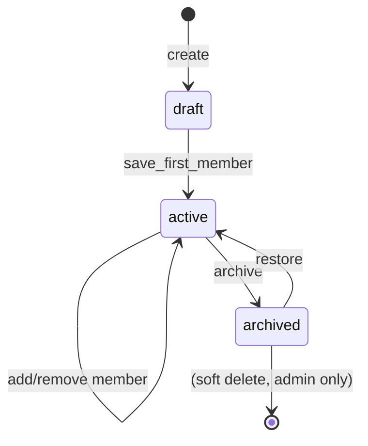
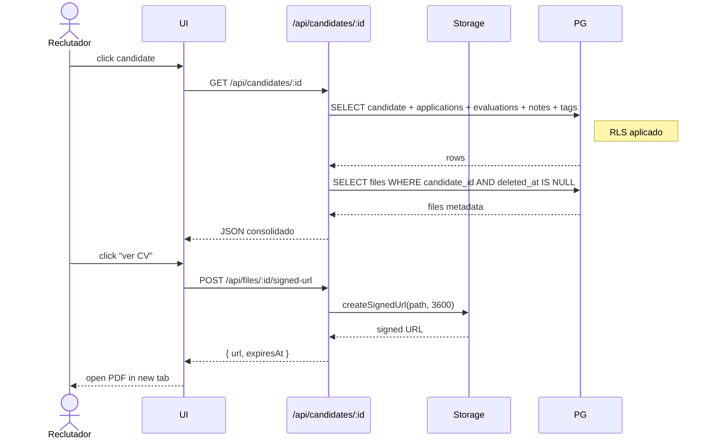
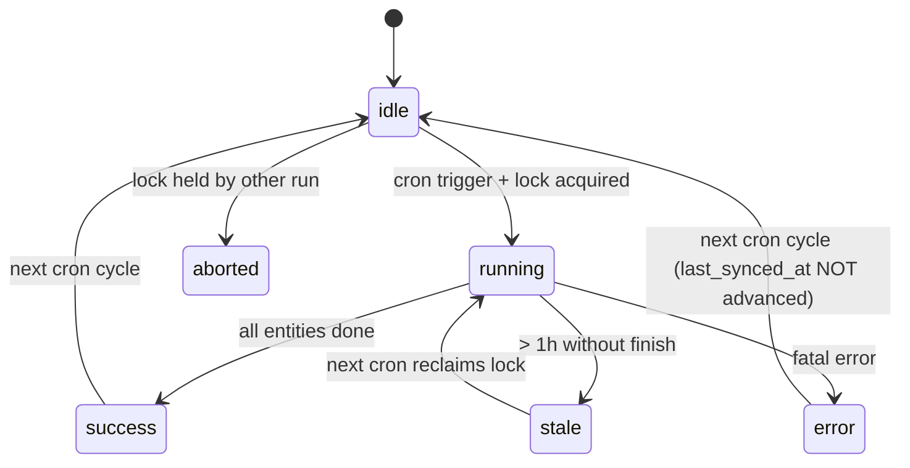
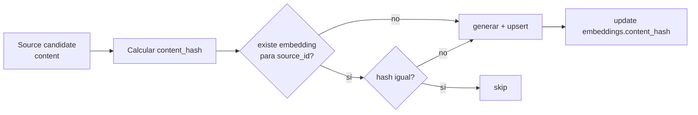
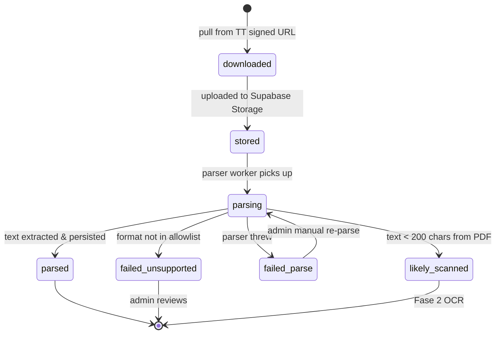
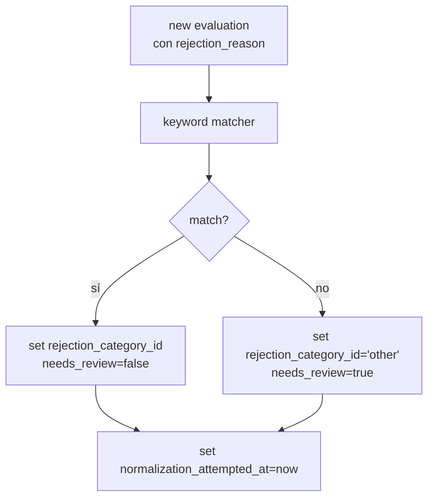

# 🎬 Use Cases & Behavioral Contracts

> Paso 5 del initialization cascade (paper §6.2). Cada use case es
> simultáneamente:
>
> - una descripción de comportamiento para humanos,
> - la especificación de un test E2E,
> - un contrato de interfaces entre capas.
>
> **Si una implementación permite una transición no listada acá, la
> implementación es incorrecta por spec, no el diagrama.**

Derivado de: `spec.md` §2 y §9.

---

## UC-01 — Re-descubrimiento de candidatos

**Actor**: Reclutador.
**Goal**: Encontrar candidates históricos que encajen con una búsqueda
nueva, incluyendo los que fueron rechazados hace años.
**Precondiciones**: Usuario autenticado con rol `recruiter` o `admin`.

### Flujo principal

1. El reclutador abre la barra de búsqueda.
2. Escribe: _"backend senior Node.js rechazado hace más de 1 año por
   nivel técnico"_.
3. Opcionalmente activa filtros (rango de fecha, rechazo, skills).
4. Recibe lista ordenada de candidates con score de similitud.
5. Click en uno → abre perfil consolidado (UC-04).
6. Puede agregarlo a una shortlist (UC-03).

### Sequence

### Acceptance criteria (tests E2E derivados)

- `test_search_filters_before_vector` — la query aplica filtros SQL
  antes del cosine similarity.
- `test_search_respects_rls` — un `recruiter` NO ve candidates con
  `deleted_at IS NOT NULL`.
- `test_search_empty_query_returns_empty` — query vacía no trigger
  embedding call ni devuelve todo.
- `test_search_rate_limits_embed` — 20 queries/s por user son
  rechazadas después de N.

---

## UC-02 — Búsqueda semántica pura

**Actor**: Reclutador.
**Goal**: Buscar por descripción cualitativa sin filtros rígidos.
**Precondiciones**: Igual a UC-01.

### Flujo

1. Reclutador escribe: _"alguien prolijo, bueno en system design,
   floja comunicación en inglés"_.
2. Sistema busca sobre embeddings de evaluations + CVs sin
   filtros estructurales.
3. Ranking puro por similitud coseno.

### Acceptance criteria

- `test_semantic_only_no_structured_filters`
- `test_semantic_aggregates_by_candidate` — si un candidate tiene 3
  embeddings que matchean, aparece UNA vez con la mejor similitud.

---

## UC-03 — Gestión de shortlists

**Actor**: Reclutador.
**Goal**: Armar, modificar y compartir listas curadas de candidates
para una búsqueda concreta.

### Estado de una shortlist

### Acceptance criteria

- `test_shortlist_creation_requires_name`
- `test_add_candidate_twice_is_idempotent`
- `test_archived_shortlist_readonly_for_recruiter`
- `test_only_creator_or_admin_can_delete`

---

## UC-04 — Ver perfil consolidado del candidate

**Actor**: Reclutador.
**Goal**: Ver todo lo que sabemos del candidate en una sola vista.

### Sequence

### Acceptance criteria

- `test_profile_returns_aggregated_data`
- `test_profile_respects_rls_soft_deleted`
- `test_signed_url_expires_in_one_hour`
- `test_signed_url_requires_auth`
- `test_recruiter_cannot_access_deleted_cv`

---

## UC-05 — Sync incremental desde Teamtailor

**Actor**: Sistema (cron).
**Goal**: Traer cambios de Teamtailor a nuestra DB sin duplicar, sin
romper ante rate limits, idempotente.

### State machine del run

### Acceptance criteria

- `test_sync_upsert_is_idempotent` — correr dos veces no duplica.
- `test_sync_respects_rate_limit` — mock server de 429 → cliente
  hace backoff, no crashea.
- `test_sync_fatal_error_preserves_last_synced_at` — si falla fatal,
  `last_synced_at` NO avanza.
- `test_sync_stale_lock_is_reclaimed` — run zombie con
  `last_run_started < now() - 1h` se puede tomar.
- `test_sync_row_error_does_not_stop_batch` — un registro que falla
  se loggea en `sync_errors`, el resto continúa.

---

## UC-06 — Generación de embeddings post-sync

**Actor**: Sistema.
**Goal**: Mantener `embeddings` sincronizado con las fuentes (CV,
evaluations, notes, profile).

### Flujo de decisión por fuente

### Acceptance criteria

- `test_embedding_regenerated_when_content_changes`
- `test_embedding_skipped_when_hash_matches`
- `test_embedding_hash_includes_model_name` — cambiar modelo fuerza
  regenerar.
- `test_embedding_worker_idempotent` — correr dos veces sin cambios
  no llama a OpenAI.

---

## UC-07 — Upload y parseo de CV

**Actor**: Sistema.
**Goal**: Subir CV a Storage privado, parsear texto, detectar scaneados.

### Estados del archivo

### Acceptance criteria

- `test_cv_rejects_file_above_10mb`
- `test_cv_skips_reupload_when_hash_matches`
- `test_cv_scanned_pdf_marked_likely_scanned`
- `test_cv_docx_parses_to_text`
- `test_signed_url_of_cv_is_one_hour`

---

## UC-08 — Soft delete y restore (admin)

**Actor**: Admin.
**Goal**: Marcar candidate como borrado sin perder historial; restaurarlo.

### Acceptance criteria

- `test_recruiter_cannot_soft_delete`
- `test_admin_soft_delete_hides_from_recruiter`
- `test_admin_can_restore`
- `test_soft_delete_preserves_cv_in_storage`
- `test_applications_of_soft_deleted_candidate_hidden_to_recruiter`

---

## UC-09 — Normalización de rejection reason (ADR-007)

**Actor**: Sistema (post-sync de evaluations).
**Goal**: Mapear texto libre a `rejection_categories`.

### Flujo

### Acceptance criteria

- `test_keyword_matches_by_priority`
- `test_no_match_sets_other_and_needs_review`
- `test_normalization_idempotent_by_attempt_timestamp`

---

## Convenciones

- Todo use case tiene **al menos** un test E2E que lo cubre punta a
  punta. Si no, el use case no está implementado.
- Todo state machine tiene test que intenta transiciones inválidas
  y **debe** devolver error (test adversarial, paper §4.3
  _Verifiable_).
- Los `test_*` nombrados arriba son el contrato — un reviewer puede
  buscarlos por grep y verificar presencia.
